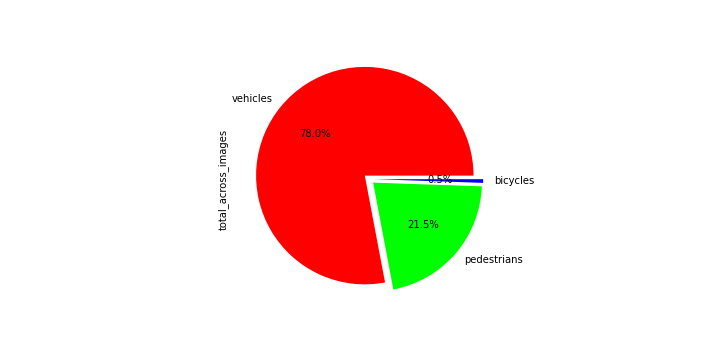

# Project Writeup - Object Detection in an Urban Environment

## Project overview
This project is concerned with 2D object detection in an urban environment.
Based on camera images taken by an ego vehicle, 3 classes of objects - other vehicles, bicycles and pedestrians - 
should be detected by a pre-trained deep learning algorithm.

The main purpose of object detection for self-driving vehicles (SDC) is to locate and classify objects in the vehicle's
surrounding and can be performed using different sensors (e.g. camera, lidar).
This is a vital task for the safe operation of an SDC, allowing it to "see" other actors in its environment.
Only if this is achieved, safe maneuvers can be planned and executed.

### Steps
As a first step, some exploratory data analysis is performed. The overall appearance of images 
(light conditions, blurs, distortions etc.) was assessed and the occurence and distribution ob objects across 
these images was analyzed in order to decide on necessary augmentations and parameters for our algorithm.

The creation of training vs. validation split, which is usually performed based on this exploratory analysis, 
was already done here, with 87:10 TFRecords in training and validation, respectively.

In the second step, the pretrained SSD Resnet 50 640x640 model (one-stage object detection), 
was downloaded from [tensorflow.org](http://download.tensorflow.org/models/object_detection/tf2/20200711/ssd_resnet50_v1_fpn_640x640_coco17_tpu-8.tar.gz)
and the respective pipeline set up for training and validation using the config file.

After a reference run on the training and validation datasets, that model should then be improved using e.g.:
* image augmentations, as available in the [preprocessor.proto file](https://github.com/tensorflow/models/blob/master/research/object_detection/protos/preprocessor.proto)
* parameter tuning / optimizer improvements: type of optimizer, learning rate, scheduler etc.
* architecture changes (incl. a new pipeline config) using the Tf Object Detection API [model zoo](https://github.com/tensorflow/models/blob/master/research/object_detection/g3doc/tf2_detection_zoo.md).

### Set up
I completed the project in the project workspace provided by Udacity.
Hence, most downloads and installations were already complete.

For information on the local setup and general approach, please refer to the README in the 
Github Starter Code Repository provided [here](https://github.com/udacity/nd013-c1-vision-starter).

## Data
### Dataset Analysis
The implementation and original images for the exploratory analysis of our dataset can be found 
in the [Exploratory Data Analysis](Exploratory+Data+Analysis.ipynb) notebook.

At first glance, it becomes obvious that the class distribution in our dataset is highly imbalanced. 
There are a lot of vehicles, as opposed to lesser pedestrians and almost no bicycles. 
Model performance (average precision, recall etc.) should thus be monitored closely especially for the minority classes. 
In order to avoid poor performance of the object detection for the minority class, 
one could adopt multitude of strategies such as data augmentation for the underrepresented class.

Further proposals, such as adapting the performance metrics, can be found [here](https://machinelearningmastery.com/tactics-to-combat-imbalanced-classes-in-your-machine-learning-dataset/).

The total occurence and proportion of the different object types is very heterogenuous across images.
There are images with vehicles only (e.g. on a highway), while there are others with more pedestrians than vehicles (e.g. on a crossroad).

Light conditions vary heavily across the dataset, with sunny conditions (leading to bright images with high contrast)
as well as rainy/foggy conditions (causing reflections and blurs in the images) alike. 
Also, there are recordings of night drives.

Image distortions can be observed as well, especially on the image edges.

In images with multiple objects, objects tend to be clustered and occlude each other.

The mentioned imbalances in the dataset are visualized below, based on 1000 images from the training dataset.
The diagram displays the percentage of objects per object type across all sampled images, 
and it can be seen that there are roughly 125x more vehicles than bicycles, 
which make up for only ~0.6% of all objects.

Hence, it can be expected that our model is likely to overfit on vehicles, whilst performing less optimal on bicycles.

For the majority class - vehicles - the images contain an average of around 17 vehicles with outliers reaching almost 70.
The distribution of pedestrians and bicycles on the other hand is much more spread out.

With such a small number of bicycles in the dataset, the boxplot for this object type can hardly be recognised.
The maximum number of bicycles in an image is 5 for the samples taken here:

On the same set of 1000 vehicles, the average image brightness has a very distinct peak at around 90 
and a smaller peak at around 130.

Except for a small cluster of very dark images, the frequency decreases towards high and low brightness values.

### Cross-validation
The creation of training vs. validation split, which is usually performed based on the exploratory analysis, 
was already done in the workspace, with 87 : 10 TFRecords in the training and validation set, respectively.
This corresponds to a 90% : 10% split, which I would have chosen as well.

## Training
### Reference experiment
As expected, the reference run with the pretrained model did not yield optimal results.
The losses decrease with the number of epochs, 
but e.g. the classification loss seems to reach a base plateau rather fast.
The final overall loss is about 4.2.

Looking at the evaluation metrics, we can observe that the average precision and recall values
are all very low (for a IoU threshold of 0.5) and that hence the model does not yet perform well on a new dataset.

### Improve on the reference - experiment0
based on the results of the exploratory data analysis, I started off using some image augmentations, e.g.
* `random_adjust_brightness` and `random_adjust_contrast` to increase the diversity in brightness and contrast across the given images
* `random_adjust_hue`, `random_rgb_to_gray` and `random_adjust_saturation` to mimic different light conditions (e.g. a blueish or yellowish tint caused by artificial lights)
* `random_patch_gaussian` to mimic blurs and flares caused by different weather conditions (e.g. rain on the camera lens)
* `random_black_patches` to mimic occlusions (i.e. caused by other objects)
* I kept the already implemented augmentations (horizontal flip and image crop)

A visualization of the implemented augmentations is shown below:

In the `experiment0` run, we again let the model run until the learning rate decayed to zero (2500 epochs).

At first glance, the model seems to have improved a lot in training: 
the maximum losses were lower than before and the plateau was reached later, i.e. the model was still improving in later runs.
The final overall loss could be reduced to around 2.7.

Precision and recall increased significantly, but still remained below 0.22.

The training and validation results are displayed below:

### Improve on the reference - experiment1

In a second step, I additionally adjusted the model parameters, 
choosing a total number of steps and a number of warmup steps 4x larger than in the reference run
(10000 and 800) in an attempt to allow the model to reach the optimum value in each iteration.
Furthermore, I lowered the base learning rate from 0.04 to 0.02.

The training and validation results are displayed below:

### Outlook

The experiments demonstrate how augmentations and model parametrization can be used to improve the performance of our model detection algorithm.
Further improvements should be made and other tactics employed e.g. for dealing specifically with the minority class,
in order to reliably detect _all_ traffic participants.

Since augmenting images on a very small set of samples has its limits, 
a first step could be to specifically collect more image data on the minority class, bicycles.