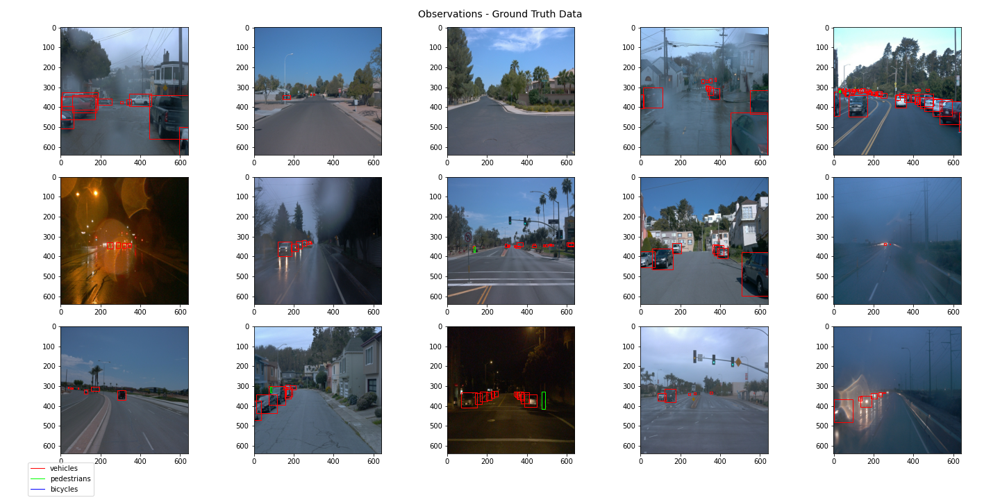

# Project Writeup - Object Detection in an Urban Environment

## Project overview
This project is concerned with 2D object detection in an urban environment.
Based on camera images taken by an ego vehicle, 3 classes of objects - other vehicles, bicycles and pedestrians - 
should be detected by a pre-trained deep learning algorithm.

The main purpose of object detection for self-driving vehicles (SDC) is to locate and classify objects in the vehicle's
surrounding and can be performed using different sensors (e.g. camera, lidar).
This is a vital task for the safe operation of an SDC, allowing it to "see" other actors in its environment.
Only if this is achieved, safe maneuvers can be planned and executed.

### Steps
As a first step, some exploratory data analysis is performed. The overall appearance of images 
(light conditions, blurs, distortions etc.) was assessed and the occurence and distribution ob objects across 
these images was analyzed in order to decide on necessary augmentations and parameters for our algorithm.

The creation of training vs. validation split, which is usually performed based on this exploratory analysis, 
was already done here, with 87:10 TFRecords in training and validation, respectively.

In the second step, the pretrained SSD Resnet 50 640x640 model (one-stage object detection), 
was downloaded from [tensorflow.org](http://download.tensorflow.org/models/object_detection/tf2/20200711/ssd_resnet50_v1_fpn_640x640_coco17_tpu-8.tar.gz)
and the respective pipeline set up for training and validation using the config file.

After a reference run on the training and validation datasets, that model should then be improved using e.g.:
* image augmentations, as available in the [preprocessor.proto file](https://github.com/tensorflow/models/blob/master/research/object_detection/protos/preprocessor.proto)
* parameter tuning / optimizer improvements: type of optimizer, learning rate, scheduler etc.
* architecture changes (incl. a new pipeline config) using the Tf Object Detection API [model zoo](https://github.com/tensorflow/models/blob/master/research/object_detection/g3doc/tf2_detection_zoo.md).

### Set up
I completed the project in the project workspace provided by Udacity.
Hence, most downloads and installations were already complete.

For information on the local setup and general approach, please refer to the README in the 
Github Starter Code Repository provided [here](https://github.com/udacity/nd013-c1-vision-starter).

## Data
### Dataset Analysis
The implementation and original images for the exploratory analysis of our dataset can be found 
in the [Exploratory Data Analysis](Exploratory+Data+Analysis.ipynb) notebook.

At first glance, it becomes obvious that the class distribution in our dataset is highly imbalanced. 
There are a lot of vehicles, as opposed to lesser pedestrians and almost no bicycles. 
Model performance (average precision, recall etc.) should thus be monitored closely especially for the minority classes. 
In order to avoid poor performance of the object detection for the minority class, 
one could adopt multitude of strategies such as data augmentation for the underrepresented class.

Further proposals, such as adapting the performance metrics, can be found [here](https://machinelearningmastery.com/tactics-to-combat-imbalanced-classes-in-your-machine-learning-dataset/).

The total occurence and proportion of the different object types is very heterogenuous across images.
There are images with vehicles only (e.g. on a highway), while there are others with more pedestrians than vehicles (e.g. on a crossroad).

Light conditions vary heavily across the dataset, with sunny conditions (leading to bright images with high contrast)
as well as rainy/foggy conditions (causing reflections and blurs in the images) alike. 
Also, there are recordings of night drives.

Image distortions can be observed as well, especially on the image edges.

In images with multiple objects, objects tend to be clustered and occlude each other.

The mentioned imbalances in the dataset are visualized below, based on the training dataset: there are over 100x more vehicles than bicycles.
The left diagram displays how many objects of a certain type could be found in one image on average.
In the right diagram, the total number of objects per object type across all images is shown.

Hence, it can be expected that our model is likely to overfit on vehicles, whilst performing less optimal on bicycles.

### Cross-validation
This section should detail the cross-validation strategy and justify your approach

## Training

### Reference experiment
This section should detail the results of the reference experiment.
It should include training metrics, Tensorboard charts, and a detailed explanation of the algorithm's performance.

### Improve on the reference
This section should highlight the different strategies you adopted to improve your model. It should contain relevant figures and details of your findings.
